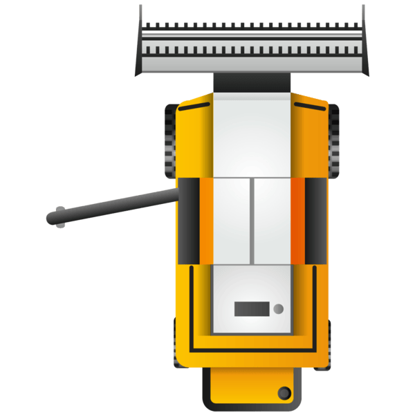

# 🚜 FarmRush - Multiplayer Edition

A real-time multiplayer farming game built with **Phaser.js** and **Devvit Web**. Compete with other players on a massive shared farm to harvest the most corn within 60 seconds! Drive your tractor, outmaneuver opponents, and climb the leaderboard.



## 🎮 Game Overview

**FarmRush** is a competitive farming game where multiple players simultaneously explore a **120x120 tile grid farm** harvesting corn. The core mechanic is simple: drive your tractor across the farm, harvest corn tiles, and watch your score climb. But with other players competing for the same corn, strategy and speed become essential.

### Game Flow
1. **WAITING (10 seconds)**: Players see each other and prepare for the competition
2. **ACTIVE (60 seconds)**: Harvest as much corn as possible before time runs out
3. **ENDED (10 seconds)**: View the final leaderboard and celebrate victory

## ✨ Key Features

### Multiplayer Mechanics
- **Real-time Player Sync** - See other players' tractors and corn counts updating via polling (400ms interval)
- **Shared Farm State** - All players harvest from the same grid; once corn is picked, it's gone until it regrows
- **Competitive Leaderboard** - Global ranking saved to Redis, displayed after each round
- **Dynamic Timers** - Server-side timer ensures all players follow the same game clock
- **Auto-regrow System** - Harvested tiles regrow after 60 seconds, creating new opportunities

### Gameplay
- **8-Direction Movement** - Smooth top-down tractor controls via keyboard (WASD/Arrow Keys) or mobile D-pad
- **Instant Harvest** - Drive over corn tiles to collect them instantly
- **Tractor Growth** - Your tractor grows larger as you harvest more corn—visual feedback of your score
- **Camera Follow** - Smooth camera tracking keeps your tractor centered
- **Responsive Design** - Optimized for desktop, tablet, and mobile Reddit webviews

### User Experience
- **Player Names** - See your competitor's names displayed above their tractors
- **Live Corn Count** - Each player's harvest count visible in real-time
- **Timer Display** - Central timer shows remaining time and game state
- **Touch Controls** - Mobile-friendly D-pad for phone/tablet players
- **Farming Theme** - Stylized green farm aesthetic with corn emoji graphics

## 🎯 How to Play

### Starting a Game
1. Launch the game as a Reddit interactive post
2. Enter your farmer name (uses your Reddit username by default)
3. Click "START FARMING" to join the lobby

### During Gameplay
| Action | Control |
|--------|---------|
| **Move Up** | W or ↑ |
| **Move Down** | S or ↓ |
| **Move Left** | A or ← |
| **Move Right** | D or → |
| **Harvest** | Drive over corn tiles |
| **Mobile** | Use D-pad buttons (bottom-right) |

### Strategy Tips
- **Explore Efficiently** - Plan routes to cover as much ground as possible
- **Watch the Timer** - The countdown in top-right shows when to push for final harvests
- **Stay Mobile** - Keep moving; static players get outfarmed
- **Return to Regrown Areas** - After 60 seconds, harvested tiles produce new corn
- **Read the Leaderboard** - Check rankings to see who's ahead

## 🏗️ Architecture

### Tech Stack
- **Frontend**: Phaser 3 (WebGL rendering)
- **Backend**: Express.js on Devvit (serverless)
- **Database**: Redis (game state, leaderboard, timers)
- **Language**: TypeScript (strict mode)
- **Build System**: Vite

### Project Structure
```
src/
├── client/                      # Phaser game (webview)
│   ├── game/
│   │   ├── main.ts             # Phaser config & startup
│   │   └── scenes/
│   │       ├── Boot.ts         # Initialization
│   │       ├── Preloader.ts    # Asset loading
│   │       ├── SplashScreen.ts # Name input
│   │       ├── LoadingScene.ts # Loading state
│   │       ├── FarmGame.ts     # Main multiplayer scene (1000+ lines)
│   │       └── GameOver.ts     # Leaderboard display
│   ├── index.html              # Entry point
│   ├── public/assets/          # Game assets
│   └── style.css               # Styling
├── server/                      # Express API
│   ├── index.ts                # Game endpoints & timer logic
│   └── core/post.ts            # Reddit post creation
└── shared/
    └── types/api.ts            # Shared TypeScript types
```

### Key Systems

#### Multiplayer Sync (Polling-Based)
Since Devvit doesn't support WebSockets, FarmRush uses **HTTP polling** with optimized intervals:

```
Position Updates:  150ms (send player position)
Player Fetch:      400ms (receive other players)
Timer Fetch:       1000ms (check game state)
Corn Fetch:        300ms (sync harvested corn)
```

**Trade-off**: Low latency (~150-400ms) vs. server load. Intervals can be tuned based on player count.

#### Game Timer State Machine
The server maintains a global timer with 3 states:

```
WAITING (10s) → ACTIVE (60s) → ENDED (10s) → WAITING...
```

All clients poll `/api/game-timer` to stay synchronized. The server initializes the timer on first request and resets it automatically.

#### Tile System
- **Grid**: 120x120 tiles, each 24x24 pixels
- **World**: 2880x2880 pixel farm
- **Tile States**: 'grown' (green) | 'harvested' (empty)
- **Regrow Timer**: 60 seconds after harvest
- **Collision**: Tractor must overlap tile center to harvest

#### Leaderboard
- **Storage**: Redis sorted set `leaderboard:{postId}` (scores)
- **Persistence**: Highest score per player is recorded
- **Ranking**: Top 10 displayed on game over
- **Fetched**: On game init and end

## 🚀 Development

### Installation
```bash
npm install
```

### Build
```bash
npm run build        # Build client and server
npm run build:client # Client only
npm run build:server # Server only
```

### Local Testing
```bash
npm run dev
```
This will:
1. Build client in watch mode
2. Build server in watch mode
3. Start Devvit playtest
4. Provide a playtest URL to test in Reddit webview

### Type Checking
```bash
npm run type-check
```

### Linting & Formatting
```bash
npm run lint         # ESLint
npm run prettier     # Code formatting
```

## 📦 API Endpoints

### Game Initialization
- `GET /api/game-init` - Get player username, current score, leaderboard

### Multiplayer Sync
- `POST /api/player-position` - Send tractor position, rotation, corn count
- `GET /api/active-players` - Fetch all active players on farm
- `GET /api/game-timer` - Get current timer state (WAITING/ACTIVE/ENDED)

### Harvesting
- `POST /api/harvest-corn` - Notify server of tile harvest
- `GET /api/harvested-corn` - Get all harvested corn positions

### Scoring
- `POST /api/save-score` - Save final score to leaderboard
- `GET /api/leaderboard` - Fetch top 10 scores

## 🎨 Game Design

### Visual Design
- **Tile Grid**: 24px tiles with 1px borders
- **Background**: Forest green (#228b22) for grass
- **Corn**: Yellow emoji (🌽) on light green tiles
- **Tractor**: Red/blue rectangle (fallback) or tractor sprite image
- **Players**: Yellow labels above own tractor, blue labels for opponents
- **Timer**: Rounded background in top-right corner

### Balance Parameters
| Setting | Value |
|---------|-------|
| Game Time | 60 seconds |
| Wait Time | 10 seconds |
| Grid Size | 120x120 tiles |
| Tile Size | 24x24 pixels |
| Regrow Time | 60 seconds |
| Tractor Speed | 250 px/second |
| Camera Lerp | 0.08 (smooth follow) |
| Base Tractor Scale | 0.06 |
| Growth Per Corn | +0.003 scale |
| Shrink Rate | -0.0002 scale/frame |

### Performance Metrics
- **Load Time**: <3 seconds in Reddit webview
- **FPS**: Locked at 60 FPS
- **Bundle Size**: ~1.5 MB (Phaser + game code)
- **Server Response**: <50ms typical

## 🔧 Extending the Game

### Adding New Features

#### Increase Game Duration
Modify `/api/game-timer` in `src/server/index.ts`:
```typescript
const gameEndTime = now + 120000; // 120 seconds instead of 60
```

#### Change Farm Grid Size
Modify `FarmGame.ts`:
```typescript
private readonly GRID_WIDTH = 150;  // 120 → 150
private readonly GRID_HEIGHT = 150; // 120 → 150
```

#### Add Power-ups
1. Create power-up tiles in `createFarmGrid()`
2. Add collision detection in `checkHarvest()`
3. Apply temporary bonus (speed, double harvest, etc.)

#### Customize Tractor Speed
Modify `FarmGame.ts`:
```typescript
private readonly TRACTOR_SPEED = 350; // 250 → 350
```

### Known Limitations & Future Improvements

#### Current
- ❌ No WebSocket support (Devvit constraint)
- ❌ Polling-based sync creates ~150-400ms latency
- ❌ No obstacle tiles yet
- ❌ No power-ups or special abilities
- ❌ No sound effects or music

#### Potential Enhancements
- ✅ Add seasonal themes (Halloween farm, Christmas farm, etc.)
- ✅ Implement power-ups (speed boost, double harvest)
- ✅ Add obstacles that block movement
- ✅ Create achievement system
- ✅ Add particle effects for harvests
- ✅ Implement clan/team leaderboards
- ✅ Add cosmetic tractor skins

## 🐛 Troubleshooting

### Black Screen on Load
- Check browser console for errors
- Verify assets loaded in Preloader
- Ensure `dist/` folder exists and is built

### Movement Not Working
- Verify keyboard event listeners initialized
- Check that `cursors` and `wasd` objects are created
- Test with both keyboard and mobile controls

### Corn Not Harvesting
- Confirm collision detection is enabled
- Check that tractor physics body is properly sized
- Verify tile state transitions in `checkHarvest()`

### Leaderboard Not Updating
- Check Redis connection in server logs
- Verify score saved before transitioning to GameOver
- Ensure `leaderboard:{postId}` key exists in Redis

### Other Players Not Visible
- Check network tab for `/api/active-players` responses
- Verify polling interval (400ms) isn't too long
- Ensure player positions being sent to server

## 📚 Documentation

- **PROJECT_SUMMARY.md** - Complete project overview and roadmap


## 🤝 Contributing

FarmRush is a Devvit Web template. Fork, customize, and deploy to your community! Contributions welcome via pull requests.

## 🎮 Deploy to Reddit

```bash
# Deploy to Devvit
npm run deploy

# Publish for review
npm run launch
```


---
## 👤 Author

Abenezer Mergia

**Built with ❤️ using Phaser + Devvit**
